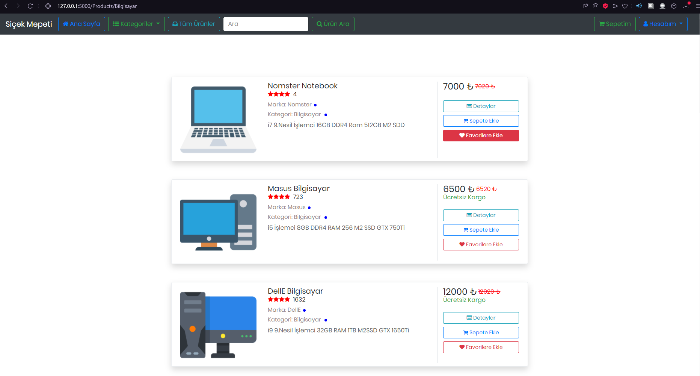
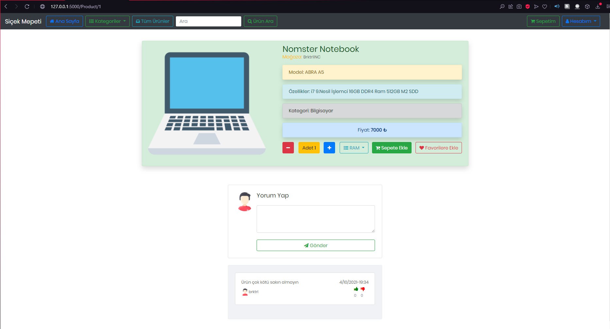
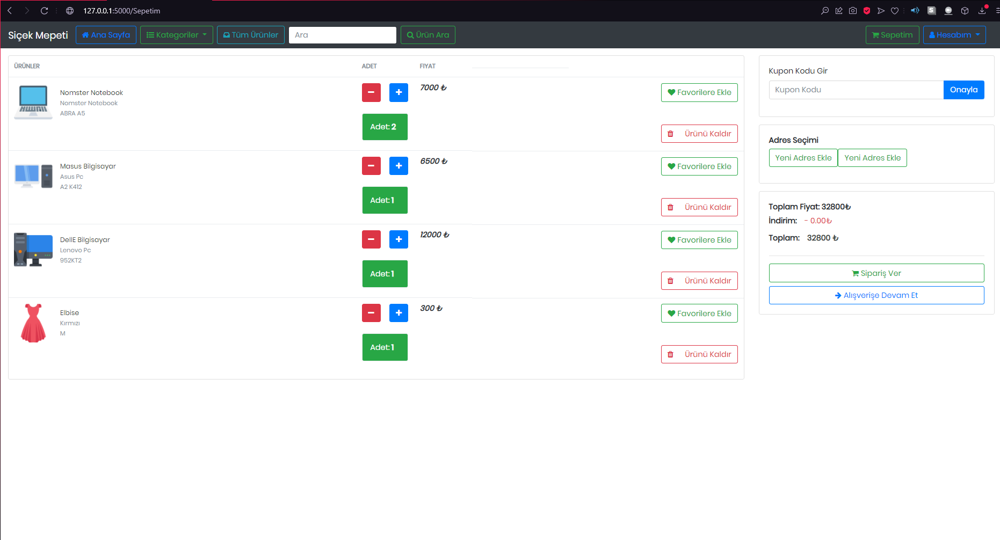
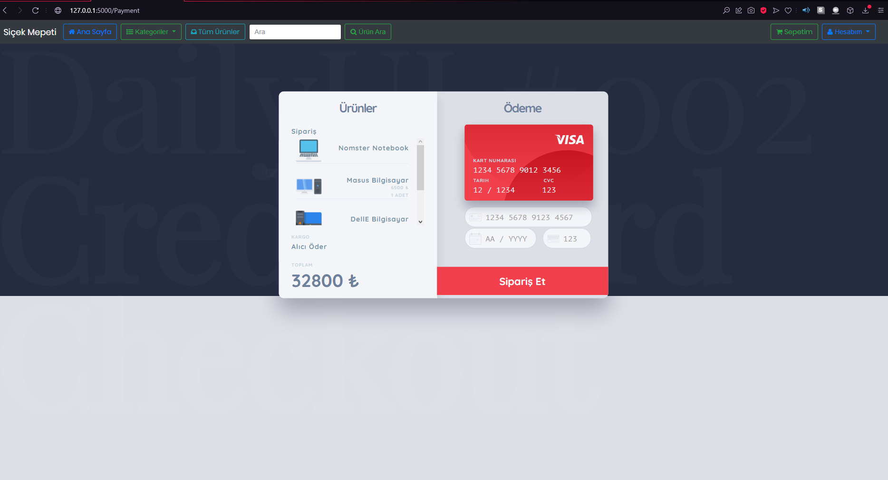

 

  

  <h3 align="center">Python Flask ile E Ticaret Sistemi</h3>

  

    E Trade System
     
     
    
<address>
      

    <a href="mailto:brktrl@protonmail.ch">Hata Bildir</a>
     
    <a href="http://www.berkay.rf.gd/" target="_blank">Web Sitesi</a>
    

    </address>
    

  

  
<h2 style="display: inline-block">Hakkında</h2>

  <ol>
    <li>
      <a href="#Program-Hakkında">Program Hakkında</a>
      <ul>
        <li><a href="#Ne-İle-Geliştirildi">Ne İle Geliştirildi</a></li>
      </ul>
    </li>
    <li>
      <a href="#Başlangıç">Başlangıç</a> 
    </li>
    <li><a href="#Kullanım">Kullanış</a></li>
    <li><a href="#Desteklediği-İşletim-Sistemleri">Desteklediği İşletim Sistemleri</a>
    <li><a href="#Görseller">Örnek Resimler</a>
    <li><a href="#lisans">Lisans</a></li>
    <li><a href="#Iletisim">İletişim</a></li>
  </ol>

## Program-Hakkında

**Klasik bir e ticaret sisteminde temel olan tüm opsiyonları Python'un flask kütüphanesi ile geliştirilmiş olup sistemlere özgü bir şekilde kullanılması amaçlanmıştır.Sadece bir veritabanına bağlı kalmayıp tek kod değişikliği ile tüm veritabanlarına geçiş yapılabilir.**

`BrktrLawliet`,
`brktrl@protonmail.ch`
`E Trade Syste`

### Ne-İle-Geliştirildi

* [Python](https://www.python.org)
* [SQLite](https://www.sqlite.org/index.html)
* [Flask](https://flask.palletsprojects.com/en/2.0.x/)
* [MySQL](https://www.mysql.com)

## Başlangıç

## Kullanım

Main.py dosyasını çalıştırıp local ortamda test edebilirsiniz.

## Desteklediği-İşletim-Sistemleri
* Tüm platformlar

## Görseller
Programın arayüzünden örnek görseller.
 
</img> 
</img> 
</img> 
</img> 
## lisans
Bu yazılım GNU GENERAL PUBLIC Lisansı ile korunmaktadır. Daha fazla bilgi için `LICENSE` dosyasını okuyunuz.
 Copyright (c) 2021 

## Iletisim

E-Mail Adresi:E-Mail - brktrl@protonmail.ch

Proje Linki: [https://github.com/Brktrlw/E-Trade-System-With-Python-Flask](https://github.com/Brktrlw/E-Trade-System-With-Python-Flask) 
Web Site Linki: [http://www.berkay.rf.gd/](http://www.berkay.rf.gd/)

